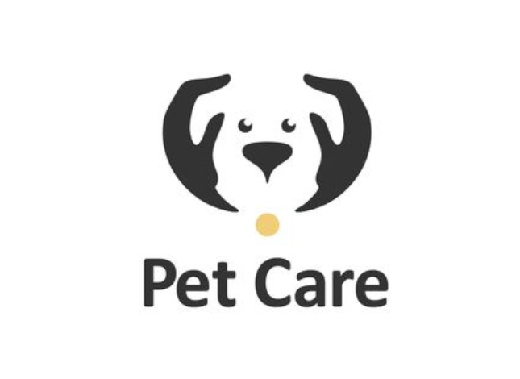

# melted-lace-627

## About The Project


PetCare is a comprehensive platform that enables pet owners to conveniently book appointments with veterinarians at clinics. It incorporates a backend system to manage pet-owner data, veterinarian availability, and appointment scheduling. The system design follows a microservices architecture to enhance scalability and reliability.

Backend deployed link:https://gentle-sunglasses-wasp.cyclic.app

frontend deployed link:https://648ff11444734c249a4f1423--singular-dieffenbachia-5da9ee.netlify.app/

# Getting Started

### Prerequisites

- npm
  ```sh
  npm install 
  ```

### Installation

1. Clone the  repo
   ```sh
   git clone https://github.com/faizansk814/melted-lace-627.git
   ```

3. Run api only
   ```sh
   npm start
   ```
 4. Run Notification only
   ```sh
   start:notification": "nodemon notification.js
   ```
 5.  Run api and notification concurrently
   ```sh
   npm run start:both
   ```
 
 6. Open http://localhost:8080 to backend run in the browser 

 ## Tools and Libraries 
 - [ExpressJs] - Node 
- [JWT] - JSON Web Token for authorization and authentication
- [nodemailer] - Sending mail
- [bcrypt] - Hashing Password
- [nodeJs] - Server environment
- [nodemon] = Run the Server
- [randomstring] -  Random strings
- [qr-image] - QR code generation
- [mongoose] - : MongoDB ODM
- [@sendgrid/mail] - Email service integration


##Images
.png)
.png)
.png)
.png)
.png)
.png)


